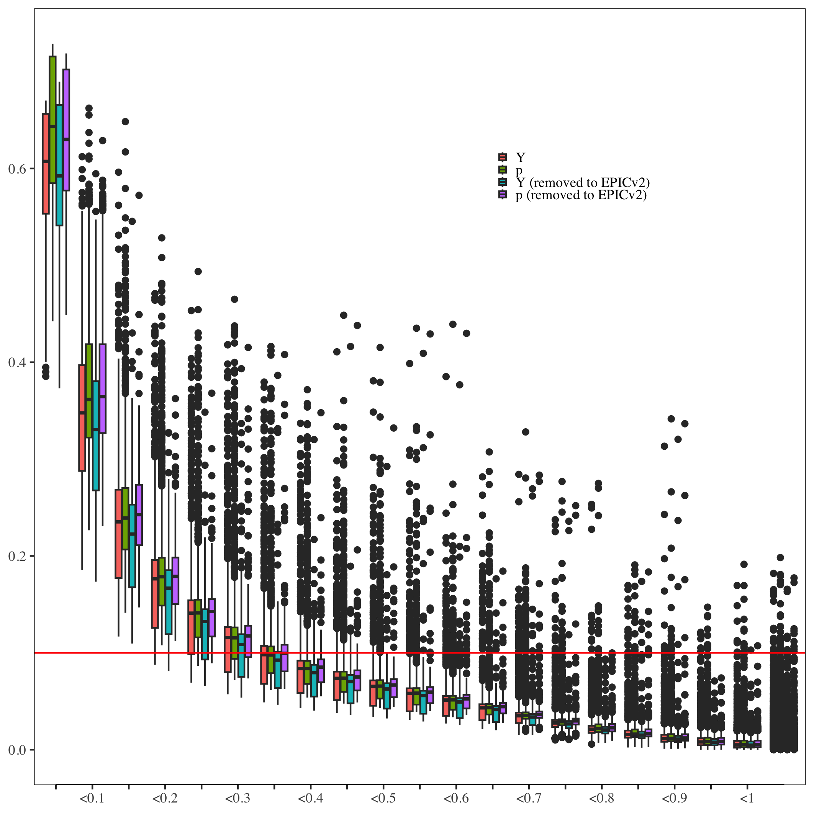
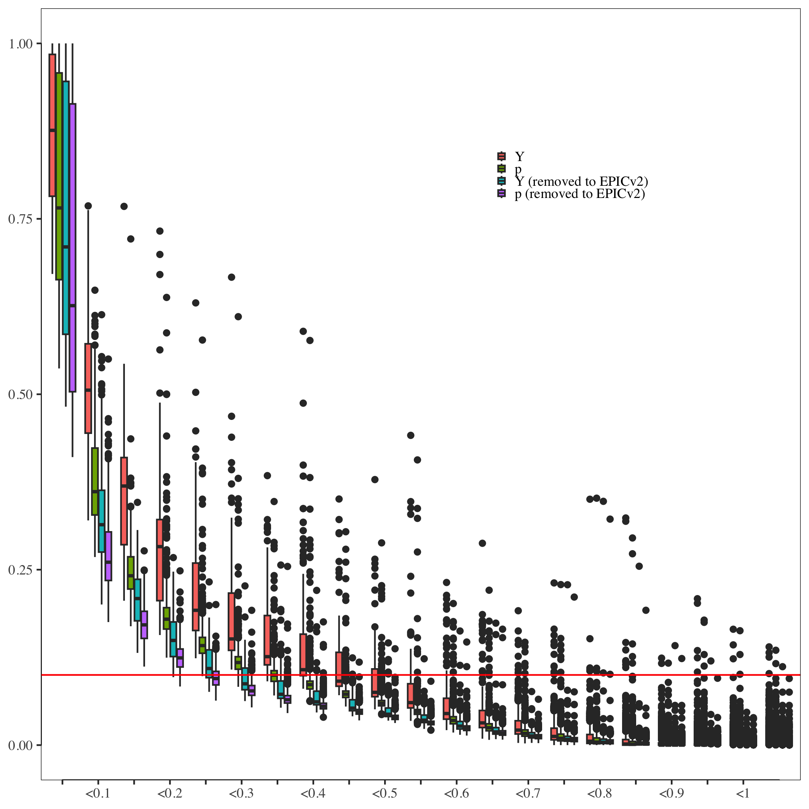

<!-- README.md is generated from README.Rmd. Please edit that file -->

# epicMI

<!-- badges: start -->
<!-- badges: end -->

Using the *unreliability_MI* function, estimate unreliability and calculate normalized mean intensities (MI) scores for Infinium probes on the
Illumina MethylationEPIC microarray v1.0, based on "noise" probes, which can be selected in two ways:
- *p-noise* method - probes, which are failed (p-value > 0.01) on 50% samples, where p-values calculated by *detectionP* function (**minfi** package) 
- *Y-noise* method - probes on the Y chromosome (for using only on female samples).

## Requirements

R \>= 3.5.0 <br> minfi \>= 1.42.0 <br> stringr <br> dplyr <br> ggpubr <br> ggplot2


## Installation

``` r
if(!require(devtools)) install.packages("devtools")
devtools::install_github("ChVav/epicMI")
```

## Example
Loading package and preparing RGset:

``` r
library(epicMI)
RGset <- read.metharray.exp(targets)
```

### *p-noise* method on probes type II  
``` r
out <- unreliability_MI(probes, RGset, noise_set,samples, grid_max_intenisty, grid_step, number_beta_generated)
```

By default, *unreliability_MI* function estimate unreliability and calculate MI scores on all samples, using *p-noise* method, with estimation on Reliability Map grid: green(0,*'grid_max_intenisty'*) x red(0,*'grid_max_intenisty'*) (where by default *'grid_max_intenisty'* = 5000), 
with *'grid_step'* = 100 and *'number_beta_generated*' = 1000:

``` r
out <- unreliability_MI(probesII_EPICv1, RGset)
```
In this example we are using probes type II of EPIC microarray v1.0: dataframe **probesII_EPICv1**, which will loaded with package. 

For using own set of **probes** (for example  for estimation of different version Illumina Methylation Beadchip array) this dataframe should have the same structure and at least have *'probe'* column (name of probes) and *'CHR'* column (with chromosome annotation).
Additionaly, we added column *'removed_to_EPICv2'* where "1" - indicated that probe of EPIC microarray v1.0 was removed to EPIC microarray v2.0, and "0" - was not.

Alternatively, this method can be run as:
``` r
out <- unreliability_MI(probesII_EPICv1, RGset, noise_set="p")
```
or on selected samples as
``` r
out <- unreliability_MI(probesII_EPICv1, RGset, noise_set="p", samples),
```
where samples names should be the same as in RGset.

### *Y-noise* method on probes probes type II

For using *Y-noise* method here are 2 options to run *unreliability_MI* function:
``` r
out <- unreliability_MI(probesII_EPICv1, RGset, noise_set="Y"),
```
if all the samples are female, 
or 
``` r
out <- unreliability_MI(probesII_EPICv1, RGset, noise_set="Y", samples = female_samples),
```
where samples names should be the same as in RGset and should be only female samples.

### Calculation only on probes which were not removed to EPIC microarray v2.0
These probes can be selected from data frame **probesII_EPICv1** by *'removed_to_EPICv2'* column:
For example, for *p-noise* method:
``` r
out <- unreliability_MI(subset(probesII_EPICv1,probesII_EPICv1$removed_to_EPICv2 == 0), RGset, noise_set="p")
```
or for *Y-noise* method:
``` r
out <- unreliability_MI(subset(probesII_EPICv1,probesII_EPICv1$removed_to_EPICv2 == 0), RGset, noise_set="Y").
```
We additionaly show, that all 4 options (using *p-noise* and *Y-noise* on probesII_EPICv1 or only on not removed probes work pretty simillar in terms of dependence of estimated unreliability and MI of probes :


### Probes probes type I
This method, can be used for calculation on probes type I, just by changing (in examples above) dataframe **probesII_EPICv1** to dataframe **probesI_EPICv1** (which will also loaded with package) or own dataframe of probes type I, which should have the same structure and at least have *'probe'* column (name of probes) and *'CHR'* column (with chromosome annotation). 
As shown on figure below the unreliability scores calculated by different option on probes type I not quite robust, therefore we recommend use only MI and apply the same threshold by it, which was established by probes type II.

 


